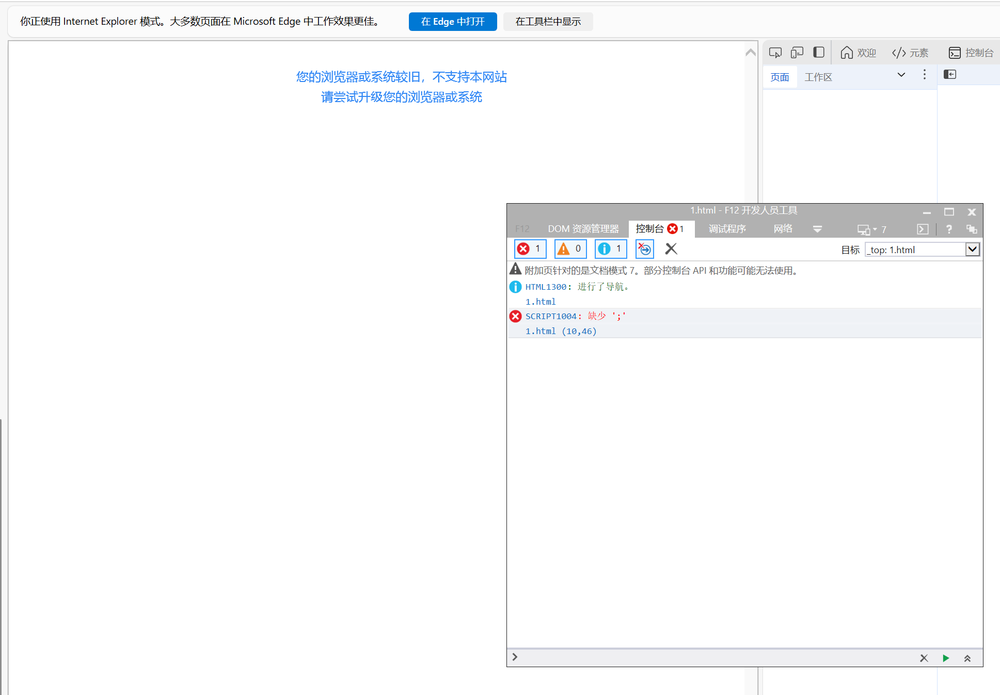

# fuck-legacy-browser
🌍 When legacy browsers visit your modern website, a full-screen prompt will be obtained.

We may want to give some hints to legacy browsers, informing them that they must upgrade their browsers in order to continue accessing our website.

We may hope that:

- It is non-intrusive, not a Vue or React component, and has no impact on our existing code at all.

- We also don't want it to redirect to third-party pages, have no advertisements, and won't provide any browser download links.

- It will cover the entire page to prevent users from seeing incorrect styles or using invalid functions.

- The user's Safari browser version must be at least 18.0. If the user is using an Android phone, the WebView version must be at least 108.



## Install

Create a `<script>` tag at the beginning of the `<head>` tag in your HTML and paste the code into it.

```js
setTimeout(function(){var ban=false;var div0=document.createElement("div");if(typeof window.Proxy==="undefined")ban=true;else if(typeof[].findLast==="undefined")ban=true;else if(typeof div0.style.contentVisibility==="undefined")ban=true;if(!ban)return;var lang="en";try{var sAgent=navigator.userAgent;if(sAgent.indexOf("Trident")>0)lang=window.navigator.browserLanguage;else lang=window.navigator.language}catch(e){}function startsWith(search,rawPos){var pos=rawPos>0?rawPos|0:0;return search.substring(pos,pos+search.length)===search}var s="";if(startsWith(lang,"zh")){s="您的浏览器或系统版本过旧，不支持本网站<br />请尝试升级您的浏览器或系统"}else if(startsWith(lang,"ja")){s="お使いのブラウザまたはシステムのバージョンが古すぎます、本サイトをサポートしていません<br />ブラウザまたはシステムをアップグレードしてください"}else if(startsWith(lang,"ko")){s="사용 중인 브라우저 또는 시스템 버전이 너무 오래되어 이 웹사이트를 지원하지 않습니다<br />브라우저 또는 시스템을 업그레이드해 주세요"}else{s="Your browser or system version is outdated and does not support this website <br /> Please try to upgrade your browser or system"}try{if(navigator.userAgent.includes("Safari")&&document.body.offsetWidth<document.body.offsetHeight){if(startsWith(lang,"zh")){s="您的系统过旧<br />更新 ios 系统至最新版本后可继续使用"}else if(startsWith(lang,"ja")){s="システムが古すぎます<br />iOSシステムを最新バージョンに更新してからご利用ください"}else if(startsWith(lang,"ko")){s="시스템이 너무 오래되었습니다<br />iOS 시스템을 최신 버전으로 업데이트한 후 사용하세요"}else{s="Your system is outdated <br /> Please update your iOS system to the latest version and continue to use it."}}}catch(e){}div0.innerHTML='<div style="background-color:#ffffff;z-index:2147483647;position:fixed;left:0;top:0;width:100%;height:100%;"><div style="width:100%;height:100%;z-index:2147483647;vertical-align:center;text-align:center;color:#3288f5;font-size:14px;line-height:1.6;padding:32px;box-sizing:border-box">'+s+'</div></div>';document.body.appendChild(div0)});
```

If you use nuxt:

```js
useHead({
  script: [
    {
      type: 'text/javascript',
      innerHTML: `setTimeout(function(){var ban=false;var div0=document.createElement("div");if(typeof window.Proxy==="undefined")ban=true;else if(typeof[].findLast==="undefined")ban=true;else if(typeof div0.style.contentVisibility==="undefined")ban=true;if(!ban)return;var lang="en";try{var sAgent=navigator.userAgent;if(sAgent.indexOf("Trident")>0)lang=window.navigator.browserLanguage;else lang=window.navigator.language}catch(e){}function startsWith(search,rawPos){var pos=rawPos>0?rawPos|0:0;return search.substring(pos,pos+search.length)===search}var s="";if(startsWith(lang,"zh")){s="您的浏览器或系统版本过旧，不支持本网站<br />请尝试升级您的浏览器或系统"}else if(startsWith(lang,"ja")){s="お使いのブラウザまたはシステムのバージョンが古すぎます、本サイトをサポートしていません<br />ブラウザまたはシステムをアップグレードしてください"}else if(startsWith(lang,"ko")){s="사용 중인 브라우저 또는 시스템 버전이 너무 오래되어 이 웹사이트를 지원하지 않습니다<br />브라우저 또는 시스템을 업그레이드해 주세요"}else{s="Your browser or system version is outdated and does not support this website <br /> Please try to upgrade your browser or system"}try{if(navigator.userAgent.includes("Safari")&&document.body.offsetWidth<document.body.offsetHeight){if(startsWith(lang,"zh")){s="您的系统过旧<br />更新 ios 系统至最新版本后可继续使用"}else if(startsWith(lang,"ja")){s="システムが古すぎます<br />iOSシステムを最新バージョンに更新してからご利用ください"}else if(startsWith(lang,"ko")){s="시스템이 너무 오래되었습니다<br />iOS 시스템을 최신 버전으로 업데이트한 후 사용하세요"}else{s="Your system is outdated <br /> Please update your iOS system to the latest version and continue to use it."}}}catch(e){}div0.innerHTML='<div style="background-color:#ffffff;z-index:2147483647;position:fixed;left:0;top:0;width:100%;height:100%;"><div style="width:100%;height:100%;z-index:2147483647;vertical-align:center;text-align:center;color:#3288f5;font-size:14px;line-height:1.6;padding:32px;box-sizing:border-box">'+s+'</div></div>';document.body.appendChild(div0)});`
    },
  ],
});
```

Perhaps you may want to customize some of your own logic. Then here is an uncompressed version.

Firstly, this piece of code will first determine whether there are some browser methods that are only available in higher versions to ensure that the user's browser version is new enough. This requires Chrome to be at least version 103, Firefox to be at least version 104. For the Safari browser, the version requirement has been raised to 16, because there were many strange issues with DOM and CSS in version 15.x.

Through `setTimeout`, it is ensured that the code can support Internet Explorer while not blocking your main code logic. Meanwhile, it is also ensured that even if there are errors in the execution of your subsequent code, the prompt for upgrading the browser can still be displayed normally. 

```js
setTimeout(function() {
    var ban = false;
    var div0 = document.createElement("div");
    if (typeof window.Proxy === "undefined") ban = true;
    else if (typeof [].findLast === "undefined") ban = true;
    else if (typeof div0.style.contentVisibility === "undefined") ban = true;
    if (!ban) return;
    
    var lang = "en";
    try {
        var sAgent = navigator.userAgent;
        if (sAgent.indexOf("Trident") > 0) lang = window.navigator.browserLanguage;
        else lang = window.navigator.language;
    } catch (e) {}
    
    function startsWith(search, rawPos) {
        var pos = rawPos > 0 ? rawPos | 0 : 0;
        return search.substring(pos, pos + search.length) === search;
    }
    
    var s = "";
    if (startsWith(lang, "zh")) {
        s = "您的浏览器或系统版本过旧，不支持本网站<br />请尝试升级您的浏览器或系统";
    } else if (startsWith(lang, "ja")) {
        s = "お使いのブラウザまたはシステムのバージョンが古すぎます、本サイトをサポートしていません<br />ブラウザまたはシステムをアップグレードしてください";
    } else if (startsWith(lang, "ko")) {
        s = "사용 중인 브라우저 또는 시스템 버전이 너무 오래되어 이 웹사이트를 지원하지 않습니다<br />브라우저 또는 시스템을 업그레이드해 주세요";
    } else {
        s = "Your browser or system version is outdated and does not support this website <br /> Please try to upgrade your browser or system";
    }
    
    try {
        if (navigator.userAgent.includes("Safari") && document.body.offsetWidth < document.body.offsetHeight) {
            if (startsWith(lang, "zh")) {
                s = "您的系统过旧<br />更新 ios 系统至最新版本后可继续使用";
            } else if (startsWith(lang, "ja")) {
                s = "システムが古すぎます<br />iOSシステムを最新バージョンに更新してからご利用ください";
            } else if (startsWith(lang, "ko")) {
                s = "시스템이 너무 오래되었습니다<br />iOS 시스템을 최신 버전으로 업데이트한 후 사용하세요";
            } else {
                s = "Your system is outdated <br /> Please update your iOS system to the latest version and continue to use it.";
            }
        }
    } catch (e) {}
    
    div0.innerHTML = '<div style="background-color:#ffffff;z-index:2147483647;position:fixed;left:0;top:0;width:100%;height:100%;"><div style="width:100%;height:100%;z-index:2147483647;vertical-align:center;text-align:center;color:#3288f5;font-size:14px;line-height:1.6;padding:32px;box-sizing:border-box">' + s + '</div></div>';
    document.body.appendChild(div0);
});
```
